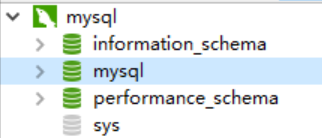

### 使用 docker 管理 mysql

#### 常用指令

* 拉取镜像 `docker pull mysql:latest`
* 查看镜像 `docker images` 和进程 `docker ps -a`
* 暂停和删除进程 `docker stop $(docker ps -aq)` 和 `docker rm $(docker ps -a -q)`
* 启动镜像 `docker run -itd --name mysql -p 3306:3306 -e MYSQL_ROOT_PASSWORD=123456 mysql`
* 采用 `bash` 进入 `mysql` : `docker exec -it mysql bash`
* 登录 mysql ：`mysql -u root -p`
* 显示所有数据库：`SHOW DATABASES;`
* 切换数据库：`use databasesname;`
* 设置远程访问权限：`ALTER USER 'root'@'%' IDENTIFIED WITH mysql_native_password BY 'mysqlroot';` 和 `grant all privileges on *.* to 'xxaxx'@'%' with grant option;`
* 查看 `ip` ，选择 `navicat` 成功实现远程连接访问：
  
  本地：
  

  `assets/images`:
  

  采用 cdn 加速之后的截图如下：

  

#### 工作小结

经过以上步骤，成功利用 docker 实现从部署、配置到应用的实现，与此同时，掌握了相关工具的基本使用指令。
